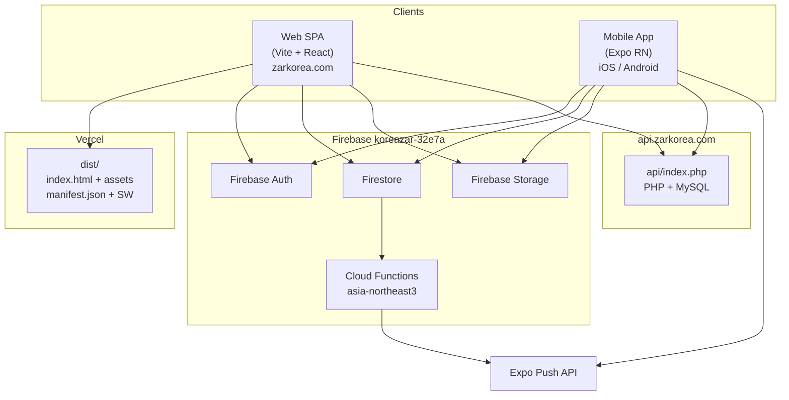
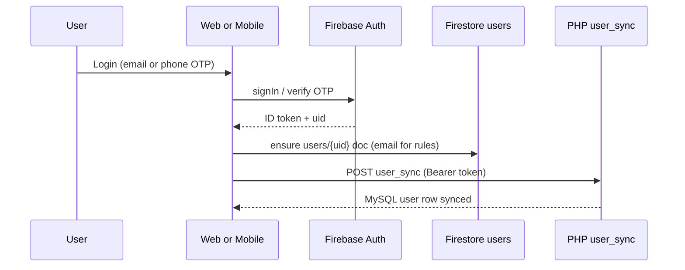

# Koreazar — Architecture

> System design for the web SPA, mobile app, PHP API, and Firebase backend.  
> **Stack versions:** Vite ^6.4.1 · React ^18.2.0 (web) · Expo ~55.0.24 · React Native 0.83.6 (mobile)

---

## High-level diagram



---

## Web application

### Entry and providers

| File | Role |
|------|------|
| `src/main.jsx` | React DOM mount |
| `src/App.jsx` | `QueryClientProvider` (3 min `staleTime`), `AuthProvider`, `Pages`, `Toaster` |
| `src/contexts/AuthContext.jsx` | Firebase auth state; lazy-loads `authService`; syncs `users/{uid}` for rules |
| `src/pages/index.jsx` | React Router v7; lazy-loaded page components |

### Routing

Client-side routes (path = component):

| Path | Page | Layout |
|------|------|--------|
| `/` | `Home` | Yes |
| `/Login`, `/Register` | Auth | No |
| `/ListingDetail` | Listing detail | Yes |
| `/CreateListing`, `/EditListing`, `/MyListings` | Listing management | Yes |
| `/SavedListings` | Saved listings | Yes |
| `/Messages`, `/Chat` | Messaging | Yes |
| `/Profile` | User profile | Yes |
| `/AIBot` | AI assistant | Yes |
| `/Privacy` | Privacy policy | Yes |
| `/AdminPanel`, `/AdminAllListings`, `/AdminNewListings`, `/AdminBanners`, `/AdminBannerRequests`, `/AdminListingReports` | Admin | Yes |
| `/RequestBannerAd`, `/UpgradeListing` | Monetization | Yes |

Vercel SPA fallback: all non-file paths rewrite to `/index.html` (`vercel.json`).

#### Market-aware routes

`src/pages/index.jsx` mounts the main listing workflow at `/kr`, `/us`, and
`/jp` (for example, `/us/CreateListing` and `/us/ListingDetail`). Root `/`
remains the KR home page. Admin routes stay unprefixed because one admin
surface applies its own country/region scope.

`src/config/country.js` is the country registry and resolver:

- `ENABLED_COUNTRIES` controls which markets are publicly selectable. KR and
  US are enabled; JP remains directly testable by URL but disabled in the
  selector unless `VITE_SHOW_ALL_COUNTRIES=true`.
- `/us` is locked to US by `src/config/countries/us.js`; the selector cannot
  switch away from ZAR-USA on that route.
- `resolveActiveCountryCode()` is for display/read context. It resolves an
  explicit build env, then route prefix, then non-root stored preference, and
  finally KR.
- `resolveRouteCountryCode()` is URL-only and must be used for writes.
  Unprefixed writes fall back to the legacy KR behavior; a stale
  `localStorage` selection must never tag data.

### Service layer (`src/services/`)

| Service | Backend | Responsibility |
|---------|---------|----------------|
| `listingService.js` | PHP API (`VITE_API_BASE_URL`) | Listings CRUD, filters, view counts |
| `bannerService.js` | Firestore `banner_ads` | Homepage banners |
| `conversationService.js` | Firestore `conversations`, `messages` | User-to-user chat |
| `authService.js` | Firebase Auth + Firestore `users` + PHP `user_sync` | Login, registration, profile |
| `storageService.js` | Firebase Storage | Image upload/compress |
| `savedListingsResolve.js` | Firestore `saved_listings` | Saved listing refs |
| `aiService.js`, `aiConversationService.js`, `aiUsageService.js` | Firestore + PHP `ai_chat` | AI bot |
| `listingReportService.js` | Firestore `listing_reports` | Report listings |
| `feedbackService.js` | Firestore `feedback_messages` | Footer feedback |
| `appConfigService.js` | Firestore `config` | App-wide settings |
| `facebookAuthService.js` | Firebase Auth (Facebook) | Social login |
| `accountDeletion.js` | Auth + Firestore | Account removal |

Entity wrappers in `src/api/entities.js` expose a stable API (`Listing`, `Conversation`, `Message`, `BannerAd`, etc.) to pages.

### PHP API (`api/`)

Hosted separately at `https://api.zarkorea.com/index.php`. Actions (from `api/index.php`):

| Action | Method | Auth | Purpose |
|--------|--------|------|---------|
| `health` | GET | No | DB connectivity check |
| `listings` | GET | No | List/filter listings; accepts `country_code`, `state_code`, and `region_code` |
| `listing` | GET/PATCH/DELETE | Bearer for writes | Single listing |
| `user_sync` | POST | Bearer | Sync Firebase user to MySQL |
| `admin_set_user_role` | POST | Super admin | Sync a scoped role to MySQL |
| `ai_chat` | POST | Bearer | OpenAI proxy |
| `ai_moderate` | POST | Bearer | Content moderation proxy |

Listings use numeric MySQL IDs (`parseMysqlListingId` in `listingService.js`).
`api/regions.php` supplies the server-side US region registry and the
country/region read and write guards used by `api/index.php`.

### Market-scoped listings

The clients and API apply complementary scope checks:

1. Web and mobile send `country_code`. US requests also send
   `region_code=washington-dc`.
2. `api/index.php` filters by country. `api/regions.php` defaults US reads and
   writes to the only active region, rejects US states outside DC/VA/MD, and
   returns no rows for inactive regions.
3. KR reads exclude rows with a non-empty `region_code`, including legacy rows
   that were accidentally tagged KR.
4. `src/utils/listingCountry.js` and its mobile mirror filter the response
   again before a market feed is rendered. This is defense in depth; the
   server-side filter is authoritative.

The US region registry is deliberately duplicated across
`src/config/regions/us.js`, `mobile/src/config/regions/us.js`, and
`api/regions.php`. Run `npm run verify:zarusa-registry` after changing any
copy. Database prerequisites and rollout order are in
[`ZARUSA_STAGING_DEPLOY.md`](./ZARUSA_STAGING_DEPLOY.md).

### PWA (`vite.config.js`)

- **Plugin:** `vite-plugin-pwa` ^1.2.0, `registerType: 'autoUpdate'`
- **Manifest:** `manifest.json` (not `.webmanifest`) — name `Zarkorea`, theme `#ea580c`, `start_url: /`
- **Workbox:** precache JS/CSS/HTML; `navigateFallback: /index.html`; runtime cache for Firebase Storage URLs
- **Performance:** `nonBlockingCss()` plugin defers CSS for LCP

Build script: `npm run build` → `sync-listings` + `sync-admin-roles` +
`generate-pwa-icons` + `vite build` → `dist/`.

---

## Mobile application (`mobile/`)

### Layout

| Path | Purpose |
|------|---------|
| `mobile/src/config/firebase.native.js` | Firebase init (native) |
| `mobile/src/config/firebase.web.js` | Firebase init (Expo web) |
| `mobile/src/services/` | Parallel services to web (listings via `apiClient.js`) |
| `mobile/app.config.js` | Resolves `GOOGLE_SERVICES_JSON` / `GOOGLE_SERVICE_INFO_PLIST` for EAS |
| `mobile/app.json` | Expo config: slug `zarkorea-app`, scheme `zarkorea`, version `1.0.5` |

### Platform split

- **Native:** `@react-native-firebase/auth` for phone OTP; `storageService.native.js`; Reanimated in `CategoryStrip.native.js`
- **Web (Expo):** `firebase.web.js`; `storageService.web.js`; `CategoryStrip.web.js`
- **Push:** `pushTokenService.js` → `user_push_tokens/{uid}/devices/{tokenId}`

`mobile/eas.json` keeps the KR `production` profile and adds
`production-us`, which sets `EXPO_PUBLIC_ACTIVE_COUNTRY=US`.
`mobile/app.config.js` then applies the ZAR-USA display name, `zarusa` scheme,
US icons, and `com.zarusa.app` identifiers without changing the shared Expo
project slug. See [`mobile/docs/ZARUSA_BUILD.md`](../mobile/docs/ZARUSA_BUILD.md).

### Constants sync

Categories and locations are authored in `src/constants/listings.js` (web). Before mobile builds:

```bash
npm run sync-listings   # from repo root
```

Copies to `mobile/src/constants/listings.js`.

---

## Authentication flow



Phone OTP users get synthetic emails (`phoneToAuthEmail`) so Firestore chat rules can match participants.

---

## Home page data path (performance-critical)

1. Browser loads `index.html` → Vite bundle → `Home` mounts.
2. React Query fetches **banners** (Firestore) and **listings** (PHP API).
3. Image URLs from responses trigger Firebase Storage / CDN fetches.

**Bottleneck:** Images cannot load until listing/banner API responses return. Mitigations documented in `docs/IMAGE_LOAD_ANALYSIS.md` (preconnect, `staleTime`, eager loading on first cards).

---

## Image pipeline

| Step | Location |
|------|----------|
| Client compression | `src/components/utils/imageCompressor.jsx` |
| Listing upload | `storageService.js` → `listings/{kr\|us\|jp}/{year}/{listingId\|draft}/{file}` |
| Banner upload | `storageService.js` → `banners/{kr\|us\|jp}/{bannerId\|draft}/{file}` |
| Profile upload | `storageService.js` → `users/{uid}/profile/{file}` |
| Legacy fallback | Unclassified uploads continue under `images/{file}` |
| URL helpers | `src/utils/imageUrl.js` |
| Storage rules | `storage.rules` — public read, auth write |

Web path builders live in `src/utils/storagePaths.js` and are mirrored under
`mobile/src/utils/storagePaths.js`. Existing legacy URLs remain valid.

---

## AI assistant

- **Web page:** `src/pages/AIBot.jsx`
- **Storage:** Firestore `ai_conversations`, `ai_messages`, `ai_usage`
- **Inference:** PHP `action=ai_chat` proxies to OpenAI (`OPENAI_API_KEY`, `OPENAI_MODEL` on server)

---

## Security architecture

| Layer | Implementation |
|-------|----------------|
| Transport | HTTPS (Vercel HSTS; API TLS) |
| Headers | `vercel.json` CSP, X-Frame-Options, etc. |
| Auth | Firebase ID tokens; Bearer on API writes |
| Data | `firestore.rules`, `storage.rules` |
| Input | `src/utils/security.js`, `bannedContent.js` |
| RBAC | Firestore `users.role` + scope fields; mirrored to MySQL for API checks |

Admin roles are defined in `src/constants/adminRoles.js` and synced to mobile
with `npm run sync-admin-roles`:

- `admin` (legacy alias) and `super_admin`: global access.
- `country_admin` + `admin_country_code`: one country.
- `region_admin` + `admin_region_code`: one US region.

Only super admins assign roles or manage global config. Country admins can
manage users and broadcasts within the supported admin workflow; region
admins cannot manage users or broadcast. Listing and banner moderation is
checked in the UI, Firestore rules, and the PHP API rather than relying on a
route guard alone.

Details: [`SECURITY.md`](./SECURITY.md) and
[`ZARUSA_REGION_PHASES.md`](./ZARUSA_REGION_PHASES.md).

---

## Shared vs platform-specific code

| Concern | Shared pattern |
|---------|----------------|
| Listings | Both clients call same PHP API |
| Chat | Both use `conversationService` (web `src/`, mobile `mobile/src/`) |
| Firebase config | Separate env prefixes: `VITE_*` vs `EXPO_PUBLIC_*` |
| UI | Web: Radix + Tailwind; Mobile: React Navigation + RN components |

Do not merge web and mobile into one bundle; keep `mobile/` isolated per `mobile/README.md`.
