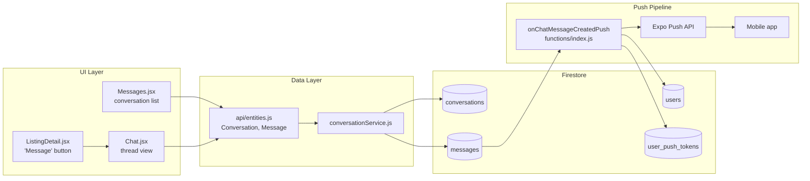

# Koreazar — Chat System

> User-to-user messaging, admin broadcast, push notifications, and Firestore schema.  
> **Primary implementation:** `src/services/conversationService.js` (web) · `mobile/src/services/conversationService.js` (mobile)

---

## Overview

The chat system lets buyers and sellers message each other about listings. Data is stored in **Firestore** (`conversations`, `messages`). The UI uses **React Query** on web and equivalent patterns on mobile. **Push notifications** are delivered via a **Cloud Function** and the **Expo Push API** for mobile clients.

Admin users can send messages to all users (`sendMessageToAllUsers`).

---

## Architecture diagram



---

## Key files

### Web pages

| File | Route | Role |
|------|-------|------|
| `src/pages/Messages.jsx` | `/Messages` | Conversation list, search, admin broadcast entry |
| `src/pages/Chat.jsx` | `/Chat?otherUserEmail=...&listingId=...` | Thread UI, send/receive, mark read |
| `src/pages/ListingDetail.jsx` | `/ListingDetail?id=...` | "Мессеж илгээх" navigates to Chat |

### Services

| File | Functions |
|------|-----------|
| `src/services/conversationService.js` | `listConversations`, `createConversation`, `findConversation`, `createMessage`, `listMessages`, `updateConversation`, `updateMessage`, `sendMessageToAllUsers`, `resolveChatParticipantEmail`, `getUnreadMessageCount` |
| `src/api/entities.js` | `Conversation.filter/create/update`, `Message.filter/create/update` wrappers |

### Mobile

| File | Role |
|------|------|
| `mobile/src/services/conversationService.js` | Parallel Firestore operations |
| `mobile/src/services/pushTokenService.js` | Register `ExponentPushToken` under `user_push_tokens` |
| Push bootstrap component | Registers token after login (see `mobile/docs/CHAT_PUSH_SETUP.md`) |

### Backend

| File | Role |
|------|------|
| `functions/index.js` | `onChatMessageCreatedPush` — Firestore trigger → Expo push |
| `firestore.rules` | Participant and sender/receiver access control |

---

## Firestore schema

### `conversations/{conversationId}`

| Field | Type | Description |
|-------|------|-------------|
| `participant_1` | string | Normalized email of participant 1 |
| `participant_2` | string | Normalized email of participant 2 |
| `participant_uids` | array | Firebase UIDs (for phone OTP and UID-based queries) |
| `last_message` | string | Preview text |
| `last_message_time` | string/timestamp | Last activity time |
| `last_message_sender` | string | Email of last sender |
| `last_message_date` | timestamp | Used for `orderBy` in inbox queries |
| `unread_count_p1` | number | Unread count for participant 1 |
| `unread_count_p2` | number | Unread count for participant 2 |
| `created_date` | timestamp | Creation time |
| `listing_id` | string | Optional linked listing |

### `messages/{messageId}`

| Field | Type | Description |
|-------|------|-------------|
| `conversation_id` | string | Parent conversation |
| `sender_email` | string | Sender (normalized) |
| `receiver_email` | string | Receiver (normalized) |
| `message` | string | Body text (banned content checked via `checkBannedContent`) |
| `is_read` | boolean | Read receipt |
| `created_date` | timestamp | Sort key |

---

## User flows

### 1. Open conversation list

```
Messages.jsx
  → useQuery
  → Conversation.filter (participant email or UID)
  → conversationService.listConversations / filterConversations
  → Firestore: conversations (indexed by participant_1/2 or participant_uids)
```

### 2. Start chat from listing

```
ListingDetail → navigate /Chat?otherUserEmail={email}&listingId={id}
Chat.jsx useEffect
  → find existing conversation (filter by participants)
  → if missing: createConversation(participant_1, participant_2, listing_id)
  → setActualConversationId
```

### 3. Send message

```
Chat.jsx handleSend
  → sendMutation
  → Message.create → conversationService.createMessage
  → Firestore: messages/ (new doc)
  → Conversation.update (last_message, unread_count, participant_uids)
  → queryClient.invalidateQueries
```

### 4. Load messages

```
Chat.jsx useQuery
  → Message.filter({ conversation_id })
  → conversationService.listMessages
  → where conversation_id == id, orderBy created_date desc
  → refetchInterval: 3000ms (web polling)
```

### 5. Mark as read

```
Chat.jsx useEffect on messages
  → filter unread where receiver == current user
  → Message.update({ is_read: true })
  → Conversation.update (reset unread_count for current participant)
```

---

## Participant resolution (email + phone OTP)

Phone users may not have `auth.token.email`. The system:

1. `AuthContext` exposes `authEmail` through `resolveAuthEmail()` — profile
   email, then Auth email, then synthetic phone email.
2. `resolveChatParticipantEmail()` applies the same canonical value before
   conversation queries.
3. `emailQueryVariants()` and `areEmailVariants()` match legacy/current phone
   synthetic emails with or without the KR `82` or US `1` country prefix.
4. `buildParticipantUids()` maintains `participant_uids` for UID-based inbox
   queries.
5. Firestore rules use `authEmailLower()` and
   `participant_uids.hasAny([request.auth.uid])`.

Indexes required: see `firestore.indexes.json` (`conversations` × 3, `messages` × 1).

---

## Push notifications

### Registration (mobile)

After login, the app registers an Expo push token:

```
user_push_tokens/{firebaseUid}/devices/{tokenId}
  expo_push_token: "ExponentPushToken[...]"
```

Requires **EAS development or production build** (not Expo Go on Android for reliable push).

### Delivery (Cloud Function)

**Trigger:** New document in `messages/{messageId}`  
**Function:** `onChatMessageCreatedPush` (`functions/index.js`, region `asia-northeast3`)

1. Normalize `receiver_email`; skip if same as sender
2. `findUidByEmail` → query `users` where `email == receiver`
3. Load tokens from `user_push_tokens/{uid}/devices/*`
4. Send batch to Expo Push API with `channelId: "chat"`, `data.type: "chat"`, `conversation_id`, `other_user_email`
5. Prune stale tokens on `DeviceNotRegistered` / `InvalidCredentials`

### Deploy push pipeline

```bash
cd functions && npm install && cd ..
firebase deploy --only firestore:rules,functions
```

### EAS / FCM requirements

| Platform | Requirement |
|----------|-------------|
| iOS | APNs key in EAS credentials |
| Android | `google-services.json` in app **and** FCM V1 service account on Expo servers |

Full checklist: `mobile/docs/CHAT_PUSH_SETUP.md`.

---

## Admin messaging

All app-admin roles (`admin`/`super_admin`, `country_admin`, `region_admin`)
can read/update conversations under Firestore rules. Broadcast capability is
narrower:

- `super_admin` and `country_admin` can call `sendMessageToAllUsers()` in
  `conversationService.js` (batch conversation/message creation).
- `region_admin` cannot broadcast or manage users (`canBroadcast()` in
  `src/constants/adminRoles.js`).

Operational walkthrough: root `ADMIN_MESSAGE_REPLY_FLOW.md`.

---

## Security rules (summary)

From `firestore.rules`:

| Collection | Read | Create | Update |
|------------|------|--------|--------|
| `conversations` | Participant or admin | Authenticated | Participant or admin |
| `messages` | Authenticated | Authenticated | Sender, receiver, or admin |

Banned content is validated client-side (`src/utils/bannedContent.js`, `api/banned_content.php` for API).

---

## Error handling

`isFirestorePermissionDenied(err)` in `conversationService.js` detects permission-denied errors — often caused by missing `users/{uid}.email` or mismatched participant emails. `authService.ensureUserDocEmailForFirestoreRules` mitigates on login.

---

## Required indexes

| Query | Index fields |
|-------|--------------|
| Inbox by email (p1) | `participant_1` ASC, `last_message_date` DESC |
| Inbox by email (p2) | `participant_2` ASC, `last_message_date` DESC |
| Inbox by UID | `participant_uids` CONTAINS, `last_message_date` DESC |
| Messages in thread | `conversation_id` ASC, `created_date` DESC |

Deploy: `firebase deploy --only firestore:indexes`

---

## QA checklist

| Step | Verify |
|------|--------|
| 1 | User A (email) and User B (phone OTP) can open `/Chat` |
| 2 | Messages appear within polling interval (~3s web) |
| 3 | Unread counts update in `/Messages` |
| 4 | `user_push_tokens/{uid}/devices/*` populated on mobile login |
| 5 | Push received when app backgrounded |
| 6 | Tap notification opens correct chat thread |
| 7 | Logout removes device token doc |

---

## Related documentation

- [FIREBASE.md](./FIREBASE.md) — rules, indexes, functions deploy
- [DEPLOYMENT.md](./DEPLOYMENT.md) — EAS and Firebase CLI
- `MESSAGE_SYSTEM_ARCHITECTURE.md` (repo root) — detailed line-level flow reference
- `mobile/docs/CHAT_PUSH_SETUP.md` — push troubleshooting
