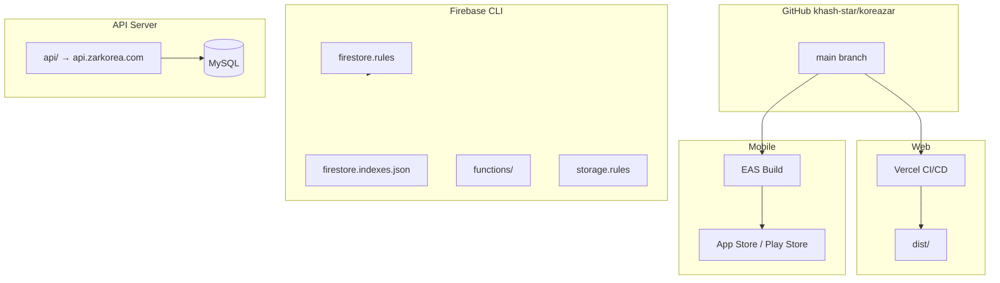

# Koreazar — Deployment

> Production deployment for web (Vercel), Firebase, mobile (EAS), and PHP API.  
> **Production web URL:** https://zarkorea.com  
> **Production API URL:** https://api.zarkorea.com/index.php

---

## Deployment overview



---

## Web — Vercel

### Configuration (`vercel.json`)

| Setting | Value |
|---------|--------|
| `framework` | `vite` |
| `buildCommand` | `npm run build` |
| `outputDirectory` | `dist` |
| `installCommand` | `npm install` |
| `devCommand` | `npm run dev` |

### Host-based redirects

`zarkorea.com` is the only public/canonical web host. The Vercel default host redirects permanently:

| Source host | Path match | Destination |
|-------------|------------|-------------|
| `koreazar.vercel.app` | `/` | `https://zarkorea.com/` |
| `koreazar.vercel.app` | `/:path+` | `https://zarkorea.com/:path*` |

Keep the root rule separate from the path rule: Vercel's `/:path+` rule does not match `/`.

### Build pipeline

```bash
npm install
npm run build
# Runs: sync-listings → generate-pwa-icons → vite build
```

Output: `dist/index.html`, hashed assets, `manifest.json`, service worker (`sw.js` / Workbox).

### SPA routing

Rewrites non-file paths to `/index.html`. Special routes:

- `/favicon.ico` → `/favicon.svg`
- `/.well-known/assetlinks.json` — Digital Asset Links for Android TWA (`public/.well-known/assetlinks.json`)

### Security headers

Set in `vercel.json`: CSP, HSTS, `X-Frame-Options: DENY`, `X-Content-Type-Options: nosniff`, etc. CSP `connect-src` allows Firebase, `api.zarkorea.com`, OpenAI, Facebook domains.

### Environment variables (Vercel dashboard)

Set for **Production** (and Preview if needed):

| Variable | Required |
|----------|----------|
| `VITE_FIREBASE_API_KEY` | Yes |
| `VITE_FIREBASE_AUTH_DOMAIN` | Yes |
| `VITE_FIREBASE_PROJECT_ID` | Yes |
| `VITE_FIREBASE_STORAGE_BUCKET` | Yes |
| `VITE_FIREBASE_MESSAGING_SENDER_ID` | Yes |
| `VITE_FIREBASE_APP_ID` | Yes |
| `VITE_API_BASE_URL` | Yes (default: `https://api.zarkorea.com/index.php`) |
| `VITE_OPENAI_API_KEY` | If using client-side AI (prefer PHP proxy) |

Template: `.env.example` at repo root.

### Manual deploy

```bash
npm run build
npx vercel --prod
```

Or connect GitHub repo in Vercel dashboard for automatic deploys on `main`.

### PWA verification

After deploy, confirm:

- https://zarkorea.com/manifest.json
- Service worker registered (DevTools → Application)
- Icons at `/icon-192.png`, `/icon-512.png`
- `curl -I https://koreazar.vercel.app/` returns `301` with `Location: https://zarkorea.com/`
- `curl -I https://koreazar.vercel.app/CreateListing` returns `301` with `Location: https://zarkorea.com/CreateListing`

---

## Firebase

### Project

```bash
firebase use koreazar-32e7a   # from .firebaserc
```

### Deploy commands

| Target | Command |
|--------|---------|
| Firestore rules | `firebase deploy --only firestore:rules` |
| Firestore indexes | `firebase deploy --only firestore:indexes` |
| Cloud Functions | `firebase deploy --only functions` |
| Storage rules | `firebase deploy --only storage` |
| Rules + functions (chat push) | `firebase deploy --only firestore:rules,functions` |

### Functions prerequisites

```bash
cd functions
npm install
cd ..
firebase deploy --only functions
```

Runtime: Node 20. Region: `asia-northeast3`.

### Index build time

Composite indexes may take minutes to build in Firebase Console. Query errors include a direct link to create missing indexes.

---

## PHP API — api.zarkorea.com

### Source

`api/` directory:

| File | Role |
|------|------|
| `index.php` | Router (`action=` parameter) |
| `bootstrap.php` | DB connection, auth helpers |
| `banned_content.php` | Content filter |
| `.htaccess` | Apache rewrite |
| `sql/schema.sql` | MySQL schema |

### Server environment (`api/.env`)

Copy from `api/.env.example`:

| Variable | Purpose |
|----------|---------|
| `DB_HOST`, `DB_PORT`, `DB_DATABASE`, `DB_USERNAME`, `DB_PASSWORD` | MySQL |
| `APP_DEBUG` | `false` in production |
| `FIREBASE_WEB_API_KEY` | Token verification |
| `OPENAI_API_KEY`, `OPENAI_MODEL` | AI endpoints |
| `APP_ADMIN_UIDS` | Admin listing overrides |

### Health check

```
GET https://api.zarkorea.com/index.php?action=health
```

Expected: `{ "ok": true, "db": "connected", ... }`

### Web client configuration

Web and mobile point to API via:

- Web: `VITE_API_BASE_URL`
- Mobile: `EXPO_PUBLIC_API_BASE_URL`

Default fallback in code: `https://api.zarkorea.com/index.php`

---

## Mobile — Expo Application Services (EAS)

### App identifiers (`mobile/app.json`)

| Platform | Value |
|----------|--------|
| Name | Zarkorea |
| Slug | `zarkorea-app` |
| Scheme | `zarkorea` |
| Version | `1.0.4` |
| iOS buildNumber | `46` |
| Android versionCode | `41` |
| Bundle ID / package | `com.zarkorea.twa` |
| EAS projectId | `96d89595-cf78-48c8-9695-5c2cc7af53f4` |

### Build profiles (`mobile/eas.json`)

| Profile | Use |
|---------|-----|
| `development` | Dev client, internal distribution |
| `preview` | Internal APK (Android `buildType: apk`) |
| `production` | Store release; `autoIncrement: true`; Android AAB with local credentials |

### NPM scripts (`mobile/package.json`)

```bash
cd mobile
npm run release:ios          # eas build --profile production --platform ios
npm run release:android      # eas build --profile production --platform android
npm run release:submit:ios   # eas submit --latest
npm run release:submit:android
```

### Production environment variables

Set on [expo.dev](https://expo.dev) → project **zarkorea-app** → Environment variables (production):

| Variable | Required |
|----------|----------|
| `EXPO_PUBLIC_FIREBASE_API_KEY` | Yes |
| `EXPO_PUBLIC_FIREBASE_AUTH_DOMAIN` | Yes |
| `EXPO_PUBLIC_FIREBASE_PROJECT_ID` | Yes |
| `EXPO_PUBLIC_FIREBASE_STORAGE_BUCKET` | Yes |
| `EXPO_PUBLIC_FIREBASE_MESSAGING_SENDER_ID` | Yes |
| `EXPO_PUBLIC_FIREBASE_APP_ID` | Yes |
| `EXPO_PUBLIC_API_BASE_URL` | Recommended |

Push from local `mobile/.env`:

```bash
cd mobile
npx eas env:push production --path .env --force
```

### Native Firebase files (EAS file env)

```bash
cd mobile
eas env:create --name GOOGLE_SERVICES_JSON --type file --value ./google-services.json --environment production
eas env:create --name GOOGLE_SERVICE_INFO_PLIST --type file --value ./GoogleService-Info.plist --environment production
```

`mobile/app.config.js` resolves these paths on the EAS builder.

### Android push (FCM V1)

Required for Expo push delivery on Android:

```bash
cd mobile
npx eas credentials
# Android → production → Google Service Account → FCM V1 → upload JSON
```

See `mobile/docs/CHAT_PUSH_SETUP.md`.

### Pre-build sync

From repo root before EAS build:

```bash
npm run sync-listings
git add mobile/src/constants/listings.js
```

### Store submission

`eas.json` submit profile:

- Android: `play-service-account.json` (local, gitignored)
- iOS: bundle `com.zarkorea.twa`

Checklist: `mobile/docs/IOS_ANDROID_RELEASE_CHECKLIST.md`

---

## Android TWA (alternative / legacy path)

Documented in `docs/PLAY_STORE_SETUP.md`:

1. PWA live on https://zarkorea.com with manifest + service worker
2. `npx @bubblewrap/cli init --manifest=https://zarkorea.com/manifest.json`
3. App ID: `com.zarkorea.twa`; theme `#ea580c`
4. Update `public/.well-known/assetlinks.json` with release SHA-256 fingerprint
5. Redeploy web; verify Digital Asset Links

**Current primary mobile path:** Native Expo app (`mobile/`), not TWA wrapper. See `mobile/docs/PLAY_STORE_RN_REPLACE_TWA.md`.

---

## DNS and domains

| Domain | Role |
|--------|------|
| `zarkorea.com` | Canonical production SPA on Vercel |
| `koreazar.vercel.app` | Vercel default host; permanent redirect to `zarkorea.com` |
| `api.zarkorea.com` | PHP API server |

DNS guides at repo root: `DOMAIN_SETUP_GUIDE.md`, `CLOUDFLARE_VERCEL_DNS.md`.

---

## CI/CD

### GitHub Actions

`.github/workflows/node.js.yml`:

- Triggers: push/PR to `main`
- Matrix: Node 18.x, 20.x, 22.x
- Steps: `npm ci` → `npm run build` → `npm test`

Does not deploy Firebase or EAS automatically — those are manual or separate pipelines.

---

## Release checklist

### Web

- [ ] `VITE_FIREBASE_*` set on Vercel Production
- [ ] `npm run build` succeeds locally
- [ ] Firestore indexes deployed if queries changed
- [ ] `manifest.json` and SW served on production
- [ ] Privacy page live at `/Privacy`

### Firebase

- [ ] `firestore.rules` deployed
- [ ] `firestore.indexes.json` deployed
- [ ] `functions` deployed (if chat push changed)
- [ ] `storage.rules` deployed

### Mobile

- [ ] `EXPO_PUBLIC_FIREBASE_*` on EAS production
- [ ] `GOOGLE_SERVICES_JSON` / `GOOGLE_SERVICE_INFO_PLIST` uploaded
- [ ] FCM V1 configured for Android push
- [ ] `npm run sync-listings` run; constants committed
- [ ] Version/build numbers bumped in `mobile/app.json`
- [ ] `eas build --profile production` succeeded
- [ ] Store submission via `eas submit` or manual upload

### API

- [ ] `api/.env` configured on server (no secrets in git)
- [ ] `action=health` returns OK
- [ ] MySQL schema up to date (`api/sql/`)

---

## Rollback

| Component | Action |
|-----------|--------|
| Vercel | Dashboard → Deployments → Promote previous deployment |
| Firebase rules | Redeploy previous `firestore.rules` from git |
| Functions | `firebase deploy --only functions` from previous commit |
| EAS | Submit previous build artifact from EAS dashboard |
| API | Redeploy previous `api/` snapshot; restore DB backup if needed |

Extended playbook: `project-memory/devops/rollback-workflow.md`.

---

## Known deployment risks

| Risk | Mitigation |
|------|------------|
| Missing Firestore indexes | `firebase deploy --only firestore:indexes` |
| Wrong Firebase env on Vercel/EAS | Match Console values exactly for `authDomain` and `storageBucket` |
| Placeholder `assetlinks.json` fingerprint | Replace with release keystore SHA-256 |
| `google-services.json` missing on EAS | File env `GOOGLE_SERVICES_JSON` |
| Android push silent failure | Upload FCM V1 to Expo credentials |
| Storage 403 | Deploy `storage.rules` |
| API CORS/auth failures | Verify `FIREBASE_WEB_API_KEY` on server |

---

## Related documentation

- [PROJECT_MEMORY.md](./PROJECT_MEMORY.md) — project overview
- [FIREBASE.md](./FIREBASE.md) — Firebase deploy details
- [CHAT_SYSTEM.md](./CHAT_SYSTEM.md) — push notification deploy
- `docs/PLAY_STORE_SETUP.md` — TWA setup
- `mobile/docs/EAS_PRODUCTION_ENV.md` — mobile Firebase env
- `VERCEL_DEPLOYMENT_GUIDE.md`, `VERCEL_ENV_SETUP.md` — extended Vercel guides (repo root)
