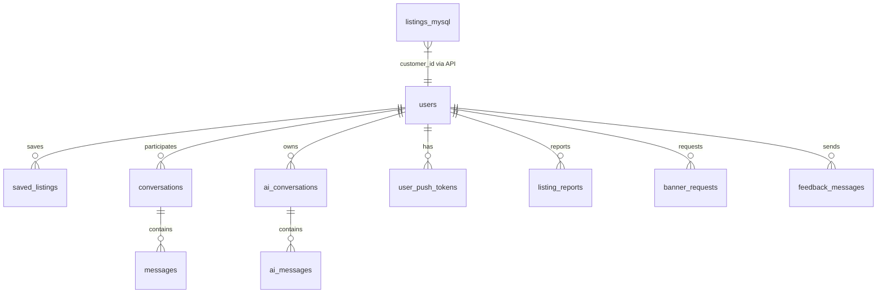

# Zarkorea — Firestore Schema

> Firestore өгөгдлийн загвар, collection-ууд, талбарууд, индекс, холбоосууд.  
> **Төсөл:** `koreazar-32e7a` · **Бүс:** `asia-northeast3`  
> **Холбоотой:** [FIREBASE.md](./FIREBASE.md) · [ARCHITECTURE.md](./ARCHITECTURE.md)

---

## Ерөнхий тойм

Zarkorea **холимог өгөгдлийн загвар** ашигладаг:

| Өгөгдөл | Хадгалалт | Тайлбар |
|---------|-----------|---------|
| **Зарууд (listings)** | **MySQL** (`api/index.php`) | Үндсэн зарын CRUD — Firestore биш |
| **Бусад бизнес өгөгдөл** | **Firestore** | Чат, баннер, хэрэглэгч, AI, тохиргоо |

Firestore дээр `listings` collection **хуучин/legacy** зориулалттай байж болно (`accountDeletion.js` устгах логикод орно). Шинэ зарууд MySQL-д хадгалагдана.

---

## Collection-уудын жагсаалт

| Collection | Document ID | Үндсэн service |
|------------|-------------|----------------|
| `users` | Firebase `uid` | `src/services/authService.js` |
| `listings` | Auto (legacy) | `accountDeletion.js` |
| `banner_ads` | Auto | `src/services/bannerService.js` |
| `banner_requests` | Auto | `src/services/bannerService.js` |
| `listing_reports` | Auto | `src/services/listingReportService.js` |
| `feedback_messages` | Auto | `src/services/feedbackService.js` |
| `saved_listings` | Auto | `src/api/entities.js` |
| `conversations` | Auto | `src/services/conversationService.js` |
| `messages` | Auto | `src/services/conversationService.js` |
| `ai_conversations` | Auto | `src/services/aiConversationService.js` |
| `ai_messages` | Auto | `src/services/aiConversationService.js` |
| `ai_usage` | `{email}_{YYYY-MM-DD}` | `src/services/aiUsageService.js` |
| `user_push_tokens/{uid}/devices/{tokenId}` | Subcollection | `mobile/src/services/pushTokenService.js` |
| `config/app` | Тогтмол `app` | `src/services/appConfigService.js` |

---

## `users/{uid}`

Хэрэглэгчийн профайл. Document ID = Firebase Auth `uid`.

| Талбар | Төрөл | Заавал | Тайлбар |
|--------|-------|--------|---------|
| `email` | string | Тийм* | Имэйл (утасны OTP: синтетик имэйл) |
| `displayName` | string | Үгүй | Харуулах нэр |
| `role` | string | Үгүй | `user` (default) эсвэл `admin` |
| `phone` / `phoneNumber` | string | Үгүй | E.164 утас |
| `customerId` | number | Үгүй | MySQL `users.id` (API sync) |
| `authProvider` | string | Үгүй | `phone`, гэх мэт |
| `profileCompleted` | boolean | Үгүй | Утасны бүртгэл дууссан эсэх |
| `kakao_id`, `wechat_id`, `whatsapp`, `facebook` | string | Үгүй | Холбоо барих |
| `blocked_seller_emails` | array | Үгүй | Блоклосон зарлагчдын имэйл |
| `termsAcceptedAt` | timestamp | Үгүй | Нөхцөл зөвшөөрсөн огноо |
| `termsVersion` | string | Үгүй | Нөхцлийн хувилбар |
| `createdAt` | timestamp/date | Үгүй | Үүсгэсэн огноо |
| `updatedAt` | date | Үгүй | Шинэчлэгдсэн огноо |

\* Firestore rules (`authEmailLower()`) ажиллахын тулд утасны хэрэглэгчид `email` талбар заавал бөглөгдөнө (`ensureUserDocEmailForFirestoreRules`).

**Rules:** Нийтэд уншигдана; өөрчлөлт — өөрийн doc эсвэл admin; `role`/`isAdmin` өөрөө өөрчлөхгүй.

---

## `listings/{listingId}` (legacy)

| Талбар | Тайлбар |
|--------|---------|
| `created_by` | Зарлагчийн имэйл |
| `title`, `category`, `status`, `views`, … | Хуучин Firestore зар |

**Одоогийн зарууд:** MySQL `listings` хүснэгт (`api/sql/schema.sql`). Талбарууд: `id`, `firebase_uid`, `customer_id`, `category`, `title`, `description`, `price`, `status`, `images` (JSON), `views`, гэх мэт.

---

## `banner_ads/{id}`

Нүүр хуудасны баннер зар.

| Талбар | Төрөл | Default | Тайлбар |
|--------|-------|---------|---------|
| `image_url` | string | — | Зургийн URL (Storage) |
| `link` | string | `#` | Дарахад очих холбоос |
| `title` | string | — | Гарчиг |
| `is_active` | boolean | `true` | Идэвхтэй эсэх |
| `order` | number | `0` | Эрэмбэ (бага = эхэнд) |
| `created_date` | timestamp | auto | Үүсгэсэн огноо |

**Query:** `is_active == true`, `orderBy('order')` — индекс: `banner_ads`: `is_active` ASC, `order` ASC.

**Rules:** Унших — бүгд; бичих — зөвхөн admin.

---

## `banner_requests/{id}`

Хэрэглэгчийн баннер зарын хүсэлт.

| Талбар | Тайлбар |
|--------|---------|
| `image_url` | Баннер зураг |
| `link`, `title` | Баннер мэдээлэл |
| `created_by` | Хүсэлт гаргагчийн имэйл |
| `status` | Төлөв (`pending`, гэх мэт) |
| `created_date` | timestamp |

**Индекс:** `created_by` ASC, `created_date` DESC.

---

## `listing_reports/{id}`

Зарын гомдол/мэдэгдэл.

| Талбар | Төрөл | Тайлбар |
|--------|-------|---------|
| `listing_id` | string | MySQL зарын ID |
| `listing_title` | string | Зарын гарчиг |
| `listing_owner` | string | Зарлагчийн имэйл |
| `category` | string | Ангилал |
| `reason` | string | Шалтгаан |
| `details` | string | Нэмэлт тайлбар |
| `reporter_email` | string | Мэдэгдэгчийн имэйл |
| `reporter_uid` | string | Мэдэгдэгчийн Firebase uid (утас OTP) |
| `status` | string | `pending` (default) |
| `created_date` | timestamp | auto |

**Rules:** Унших — мэдэгдэгч эсвэл admin; үүсгэх — auth; засах — admin.

---

## `feedback_messages/{id}`

Footer санал хүсэлт.

| Талбар | Тайлбар |
|--------|---------|
| `name`, `phone`, `email` | Холбоо барих |
| `message` | Саналын текст |
| `user_uid` | Илгээгчийн uid (утас OTP) |
| `status` | `new` (default) |
| `created_date` | timestamp |

**Rules:** Үүсгэх — auth; унших/засах — admin.

---

## `saved_listings/{id}`

Хадгалсан зар.

| Талбар | Төрөл | Тайлбар |
|--------|-------|---------|
| `listing_id` | string | MySQL зарын ID |
| `user_uid` | string | Firebase uid |
| `created_by` | string | Хэрэглэгчийн имэйл |
| `created_date` | timestamp | auto |

**Индекс:** `created_by` ASC, `created_date` DESC.

**Rules:** Унших — auth; үүсгэх/устгах — өөрийн `user_uid` эсвэл имэйл.

---

## `conversations/{id}`

Хэрэглэгч хоорондын чат.

| Талбар | Төрөл | Тайлбар |
|--------|-------|---------|
| `participant_1` | string | Оролцогч 1 (normalized email) |
| `participant_2` | string | Оролцогч 2 |
| `participant_uids` | array | Firebase UID-ууд |
| `listing_id` | string | Холбогдсон зар (optional) |
| `last_message` | string | Сүүлийн мессежийн урьдчилсан харагдац |
| `last_message_sender` | string | Сүүлийн илгээгчийн имэйл |
| `last_message_time` | string/timestamp | Сүүлийн илгээсэн цаг |
| `last_message_date` | timestamp | Inbox эрэмбэлэлт |
| `unread_count_p1` | number | P1 уншаагүй тоо |
| `unread_count_p2` | number | P2 уншаагүй тоо |
| `created_date` | timestamp | auto |

**Индексүүд:**

- `participant_1` + `last_message_date` DESC
- `participant_2` + `last_message_date` DESC
- `participant_uids` array-contains + `last_message_date` DESC

Дэлгэрэнгүй: [CHAT_SYSTEM.md](./CHAT_SYSTEM.md).

---

## `messages/{id}`

Чатын мессеж.

| Талбар | Төрөл | Default | Тайлбар |
|--------|-------|---------|---------|
| `conversation_id` | string | — | Эцэг conversation |
| `sender_email` | string | — | Илгээгч |
| `receiver_email` | string | — | Хүлээн авагч |
| `message` | string | — | Текст (`checkBannedContent` шалгана) |
| `is_read` | boolean | `false` | Уншсан эсэх |
| `created_date` | timestamp | auto | Огноо |

**Индекс:** `conversation_id` ASC, `created_date` DESC.

**Cloud Function:** Шинэ doc үүсэхэд `onChatMessageCreatedPush` → Expo push.

---

## `ai_conversations/{id}`

AI туслахын ярилцлага (нэг хэрэглэгч).

| Талбар | Тайлбар |
|--------|---------|
| `user_email` | Эзэмшигчийн имэйл |
| `message_count` | Мессежийн тоо |
| `created_date` | timestamp |
| `last_message_date` | timestamp |

**Rules:** `user_email == request.auth.token.email`.

---

## `ai_messages/{id}`

AI ярианы мессеж.

| Талбар | Тайлбар |
|--------|---------|
| `conversation_id` | `ai_conversations` ID |
| `user_email` | Эзэмшигч |
| `role` | `user` / `assistant` |
| `content` / `message` | Агуулга |
| `created_date` | timestamp |

---

## `ai_usage/{usageId}`

Өдөр тутмын AI хэрэглээ. Document ID: `{userEmail}_{YYYY-MM-DD}`.

| Талбар | Төрөл | Тайлбар |
|--------|-------|---------|
| `user_email` | string | Хэрэглэгч |
| `date` | timestamp | Өдөр |
| `request_count` | number | Хүсэлтийн тоо |
| `total_tokens` | number | Нийт token |
| `prompt_tokens` | number | Prompt token |
| `completion_tokens` | number | Completion token |
| `estimated_cost` | number | Тооцоолсон зардал |
| `last_request_date` | timestamp | Сүүлийн хүсэлт |

---

## `user_push_tokens/{uid}/devices/{tokenId}`

Expo push token (зөвхөн mobile).

| Талбар | Тайлбар |
|--------|---------|
| `expo_push_token` | `ExponentPushToken[...]` |
| `platform` | `ios` / `android` |
| `updated_at` | serverTimestamp |

`tokenId` = token string-ийн Firestore-safe хувилбар (`pushTokenDocId`).

**Rules:** Зөвхөн `request.auth.uid == userId`.

---

## `config/app`

Аппын тохиргоо (нэг document).

| Талбар | Төрөл | Тайлбар |
|--------|-------|---------|
| `listingAutoApprove` | boolean | `true` бол шинэ зар шууд `active` |

**Rules:** Унших — auth; бичих — admin.

---

## Entity холбоосууд (диаграм)



`listings_mysql` = MySQL `listings` хүснэгт (Firestore биш).

---

## MySQL schema (зарууд)

Файл: `api/sql/schema.sql`

| Хүснэгт | Түлхүүр талбарууд |
|---------|-------------------|
| `users` | `id`, `firebase_uid`, `email`, `role` |
| `listings` | `id`, `firebase_uid`, `customer_id`, `category`, `title`, `status`, `images` (JSON) |
| `listing_images` | `listing_id`, `storage_url`, `sort_order` |

API: `GET ?action=listings`, `GET ?action=listing&id=`, `POST/PATCH` (Bearer token).

---

## Индекс deploy

Бүх индекс: `firestore.indexes.json`

```bash
firebase deploy --only firestore:indexes
```

Хурдан лавлагаа: `docs/FIRESTORE_INDEXES.md`.

---

## Хязгаарлалт (client)

`src/utils/limits.js`:

| Хязгаар | Утга |
|---------|------|
| `MAX_LISTINGS_PER_USER` | 50 |
| `MAX_IMAGES_PER_LISTING` | 10 |
| `MAX_IMAGE_SIZE` | 5 MB |
| `MAX_MESSAGES_PER_CONVERSATION` | 1000 |
| `MESSAGE_FETCH_LIMIT` | 100 |
| `LISTINGS_PER_PAGE` | 20 |

---

## Холбоотой баримтууд

- [FIREBASE.md](./FIREBASE.md) — rules, deploy, env нэрүүд
- [CHAT_SYSTEM.md](./CHAT_SYSTEM.md) — чатын урсгал
- [ARCHITECTURE.md](./ARCHITECTURE.md) — service layer
- `firestore.rules` — эх сурвалж security rules
- `api/sql/schema.sql` — MySQL зарын schema
