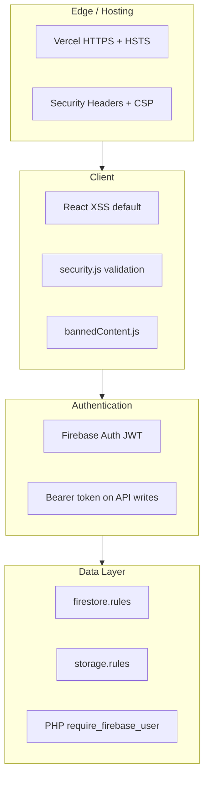

# Zarkorea — Security

> Хамгаалалтын архитектур, хэрэгжүүлсэн хяналтууд, дүрэм, зөвлөмж.  
> **Эх сурвалж:** `vercel.json`, `firestore.rules`, `storage.rules`, `src/utils/security.js`, `api/bootstrap.php`

---

## Хамгаалалтын давхаргууд



---

## 1. HTTP Security Headers (Vercel)

Файл: `vercel.json` — бүх route-д (`source: /(.*)`).

| Header | Утга | Зорилго |
|--------|------|---------|
| `X-Content-Type-Options` | `nosniff` | MIME sniffing хориглох |
| `X-Frame-Options` | `DENY` | Clickjacking хориглох |
| `X-XSS-Protection` | `1; mode=block` | XSS (legacy browser) |
| `Strict-Transport-Security` | `max-age=31536000; includeSubDomains; preload` | HTTPS албадлага |
| `Referrer-Policy` | `strict-origin-when-cross-origin` | Referrer хяналт |
| `Permissions-Policy` | `geolocation=(), microphone=(), camera=()` | Browser permission хязгаар |
| `Content-Security-Policy` | (урт директив) | XSS, injection хориглох |

### CSP зөвшөөрсөн эх сурвалжууд (товч)

| Директив | Зөвшөөрөл |
|----------|-----------|
| `default-src` | `'self'` |
| `script-src` | `'self'`, `gstatic.com`, `google.com`, `apis.google.com`, `connect.facebook.net` |
| `connect-src` | `'self'`, `api.zarkorea.com`, `*.firebaseio.com`, `*.googleapis.com`, `*.firebaseapp.com`, `api.openai.com`, Facebook, `wss://*.firebaseio.com` |
| `img-src` | `'self'`, `data:`, `https:`, `blob:` |
| `frame-src` | Google, Firebase, Facebook |
| `object-src` | `'none'` |
| `form-action` | `'self'` |

CSP өөрчлөхөд `vercel.json` болон шинэ integration-ийн домэйныг нэмнэ.

---

## 2. Нууц мэдээлэл (secrets)

### Хэзээ ч commit хийхгүй

- `.env`, `api/.env`
- `mobile/google-services.json`, `mobile/GoogleService-Info.plist`
- `mobile/play-service-account.json`
- Firebase service account JSON
- OpenAI API key утгууд

### Зөвхөн нэрээр (утга биш)

| Орчин | Хувьсагчийн prefix / нэр |
|-------|---------------------------|
| Web (Vercel) | `VITE_FIREBASE_*`, `VITE_API_BASE_URL`, `VITE_OPENAI_API_KEY` |
| Mobile (EAS) | `EXPO_PUBLIC_FIREBASE_*`, `EXPO_PUBLIC_API_BASE_URL` |
| EAS file env | `GOOGLE_SERVICES_JSON`, `GOOGLE_SERVICE_INFO_PLIST` |
| PHP API | `DB_*`, `FIREBASE_WEB_API_KEY`, `OPENAI_API_KEY`, `APP_ADMIN_UIDS` |

`VITE_*` болон `EXPO_PUBLIC_*` утгууд client bundle-д орно — энэ нь Firebase web API key-ийн хувьд **хэвийн** (Firebase Console-оос хамгаалагдсан домэйн/rule-ээр).

---

## 3. Authentication

### Firebase Auth

| Онцлог | Хэрэгжилт |
|--------|-----------|
| Token удирдлага | Firebase SDK автоматаар |
| Нууц үг | Хамгийн багадаа 6 тэмдэгт (`validatePassword`) |
| Имэйл формат | `isValidEmail()` |
| Утас OTP | Синтетик имэйл → Firestore rules-тай нийцүүлэх |
| Дахин баталгаажуулалт | Бүртгэл устгахад `reauthenticateWithCredential` |

Файлууд: `src/services/authService.js`, `src/contexts/AuthContext.jsx`, `mobile/src/services/authService.js`.

### PHP API Bearer token

Бичих endpoint-ууд `Authorization: Bearer {Firebase ID token}` шаарддаг (`api/bootstrap.php` → `require_firebase_user()`).

Шалгалтанд `FIREBASE_WEB_API_KEY` (серверийн `.env`) ашиглана — **client-д бүү илгээ**.

### Admin эрх

- Firestore: `users/{uid}.role == 'admin'` (`firestore.rules` → `isAdmin()`)
- PHP: `APP_ADMIN_UIDS` (comma-separated Firebase UID) — local super-admin allowlist; Firestore дээр яг `admin` эсвэл `super_admin` эрх давхар таарах шаардлагатай
- Admin өөрөө `role` талбарыг өөрчлөхгүй (rules хориглоно)

Тохируулах: root `ADMIN_SETUP_GUIDE.md`.

---

## 4. Input validation & sanitization

Файл: `src/utils/security.js`

| Функц | Зорилго |
|-------|---------|
| `sanitizeHTML()` | HTML XSS-ээс хамгаалах |
| `sanitizeInput()` | Script tag, event handler устгах |
| `sanitizeURL()` | `javascript:`, `data:` протокол хориглох |
| `escapeHTML()` | HTML тусгай тэмдэгт escape |
| `isValidEmail()` | Имэйл формат |
| `isValidURL()` | URL формат (http/https) |
| `isValidPhone()` | Утасны формат |
| `validatePassword()` | Нууц үгийн хүч |

### Хориглосон агуулга

- Client: `src/utils/bannedContent.js` — чат, зарын текст
- Server: `api/banned_content.php` — API proxy

### React XSS

- Default React escaping ашиглана
- `dangerouslySetInnerHTML` зөвхөн static CSS (`chart.jsx`) дээр

---

## 5. Firestore Security Rules

Файл: `firestore.rules` (version `2`)

### Collection түвшний хураангуй

| Collection | Read | Write |
|------------|------|-------|
| `users` | Бүгд | Өөрөө / admin; `role` өөрчлөхгүй |
| `listings` | Бүгд | Auth create; owner/admin update/delete |
| `banner_ads` | Бүгд | Admin only |
| `banner_requests` | Auth | Auth create; admin update |
| `listing_reports` | Reporter / admin | Auth create; admin update |
| `feedback_messages` | Admin | Auth create |
| `saved_listings` | Auth | Owner create/delete |
| `conversations` | Participant / admin | Participant / admin |
| `messages` | Auth | Auth create; sender/receiver/admin update |
| `ai_*` | Owner (`user_email`) | Owner |
| `user_push_tokens` | Owner uid | Owner uid |
| `config` | Auth | Admin |
| `ai_usage` | Owner / admin | Owner |

### Тусгай логик

- **View count:** Auth хэрэглэгч зөвхөн `views` талбарыг +1 increment хийж болно (`listings` rules).
- **Утасны хэрэглэгч:** `authEmailLower()` — token.email хоосон бол `users/{uid}.email` ашиглана.
- **Чат:** `participant_uids` эсвэл имэйлээр оролцогч шалгана.

Deploy:

```bash
firebase deploy --only firestore:rules
```

---

## 6. Firebase Storage Rules

Файл: `storage.rules`

| Path | Read | Write |
|------|------|-------|
| `images/**`, `public/**`, `listings/**`, `banners/**` | Бүгд | Auth |
| `users/{userId}/**` | Бүгд | Зөвхөн `uid` эзэн |
| Бусад | Denied | Denied |

Deploy (`firebase.json`-д ороогүй):

```bash
firebase deploy --only storage
```

---

## 7. File upload хамгаалалт

| Хяналт | Утга / байршил |
|--------|----------------|
| Зургийн формат | JPG, PNG, WEBP |
| Зургийн хэмжээ | 5 MB (`limits.js` → `MAX_IMAGE_SIZE`) |
| Баннер хэмжээ | 10 MB (`MAX_BANNER_SIZE`) |
| Зураг багтаалт | Client compression (`imageCompressor.jsx`) |
| Storage | Firebase Storage authenticated write |

---

## 8. API аюулгүй байдал

| Онцлог | Тайлбар |
|--------|---------|
| CORS | `Access-Control-Allow-Origin: *` (`api/index.php`) — зөвхөн public read endpoint-уудад анхаар |
| Debug | `APP_DEBUG=false` production-д |
| SQL | PDO prepared statements (`api/bootstrap.php`) |
| OpenAI proxy | Key зөвхөн серверийн `OPENAI_API_KEY` |

---

## 9. Mobile нэмэлт

| Онцлог | Тайлбар |
|--------|---------|
| Push token | Зөвхөн өөрийн `user_push_tokens/{uid}` |
| Native config | `google-services.json` gitignore; EAS file env |
| Expo Go | Android push найдвартай биш — EAS build шаардлагатай |
| Account deletion | Apple 5.1.1(v) — `accountDeletion.js` Firestore + Auth устгана |

---

## 10. Client хязгаарлалт (abuse prevention)

`src/utils/limits.js`:

- Хэрэглэгч тутамд хамгийн ихдээ **50 зар**
- Зар тутамд **10 зураг**
- Ярилцлага тутамд **1000 мессеж**

Firebase Free Tier-ийн read/write хязгаарлалтыг бодож query limit, `staleTime` (3 мин) ашиглана.

---

## 11. Production checklist

| # | Шалгах зүйл |
|---|-------------|
| 1 | `VITE_FIREBASE_*` Vercel Production дээр тохируулагдсан |
| 2 | `firestore.rules` deploy хийгдсэн |
| 3 | `storage.rules` deploy хийгдсэн |
| 4 | `api/.env` сервер дээр, `APP_DEBUG=false` |
| 5 | Admin role зөвхөн Firebase Console-оор оноогдсон |
| 6 | `.env` файлууд git-д ороогүй |
| 7 | CSP шинэ домэйн нэмэгдсэн эсэх (шинэ integration) |

---

## 12. Мэдэгдэх аюул, зөвлөмж

| Асуудал | Зөвлөмж |
|---------|---------|
| Client-д OpenAI key | `VITE_OPENAI_API_KEY` илрүүлэгдэнэ — PHP `ai_chat` proxy ашигла |
| Public Firestore user read | `users` collection нийтэд уншигдана — хувийн мэдээлэл бүү хадгал |
| Rate limiting | Vercel default; нэмэлт хэрэгтэй бол API/Functions түвшинд |
| Dependency CVE | `npm audit`, тогтмол шинэчлэлт |
| Monitoring | Firebase Console Auth/Firestore/Functions logs |

---

## Нэмэлт эх сурвалж

- [FIREBASE.md](./FIREBASE.md) — Firebase deploy, env нэрүүд
- [FIRESTORE_SCHEMA.md](./FIRESTORE_SCHEMA.md) — collection бүтэц
- [DEPLOYMENT.md](./DEPLOYMENT.md) — production deploy
- Root `SECURITY.md` — анхны хураангуй (энэ файл илүү бүрэн)
- [OWASP Top 10](https://owasp.org/www-project-top-ten/)
- [Firebase Security Rules](https://firebase.google.com/docs/rules)
