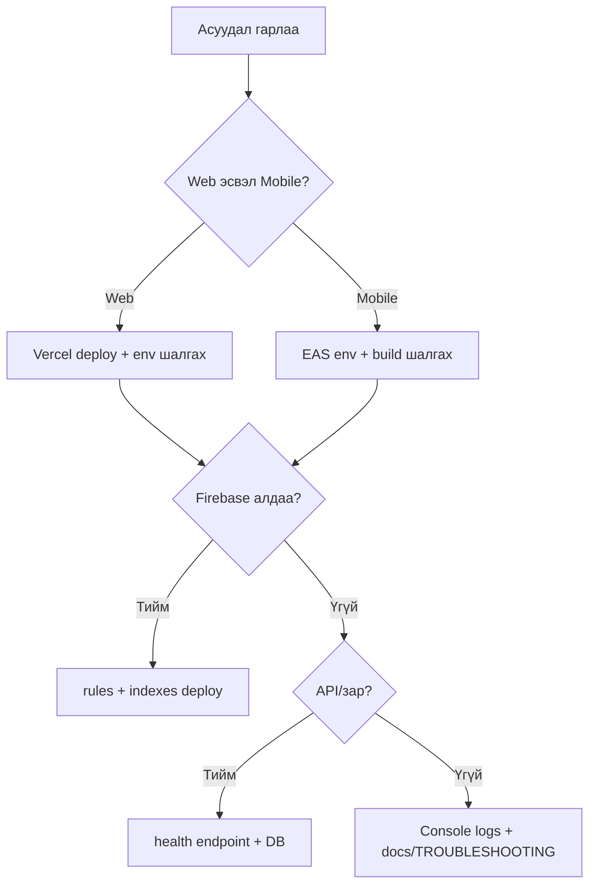

# Zarkorea — Troubleshooting

> Түгээмэл асуудал, шалтгаан, шийдэл.  
> **Эх сурвалж:** кодын сан, production deploy туршлага, `project-memory/known-bugs.md`

---

## Хурдан оношилгоо

| Шинж тэмдэг | Эхлээд шалгах |
|-------------|---------------|
| Цагаан хуудас / SPA 404 | Vercel rewrite, `dist/` build |
| `koreazar.vercel.app` index-д орж байна | Vercel redirect, canonical, sitemap |
| Firebase auth алдаа | `VITE_FIREBASE_*` / `EXPO_PUBLIC_FIREBASE_*` |
| Permission denied (Firestore) | `firestore.rules` deploy, `users/{uid}.email` |
| Index алдаа | `firebase deploy --only firestore:indexes` |
| Зар харагдахгүй | PHP API `?action=health`, `VITE_API_BASE_URL` |
| Чат ажиллахгүй | Нэвтрэлт, participant email, indexes |
| Push ирэхгүй | Functions deploy, FCM V1, Expo token |
| Mobile crash нээхэд | EAS Firebase env дутуу |

---

## 1. Web — Vercel / Build

### `vite: command not found` (Vercel build)

**Шалтгаан:** `vite` devDependency, build command буруу.

**Шийдэл:**
- `vercel.json`: `"buildCommand": "npm run build"`
- `package.json` дээр `vite` devDependencies-д байгаа эсэх
- Vercel Node version 18+

### Deploy хийсэн ч сайт шинэчлэгдэхгүй

**Шалтгаан:** GitHub холболт, буруу branch.

**Шийдэл:**
- Vercel → Project → Git → `main` branch
- Manual redeploy: Deployments → Redeploy
- Root `VERCEL_GITHUB_CONNECTION_FIX.md` (түүхэн лавлагаа)

### Route refresh дээр 404

**Шалтгаан:** SPA fallback байхгүй.

**Шийдэл:** `vercel.json` rewrites:

```json
{ "source": "/((?!.*\\..*).*)", "destination": "/index.html" }
```

### Vercel preview домэйн redirect хийхгүй

**Шалтгаан:** `vercel.json` дээр host-based redirect дутуу эсвэл redirect нь SPA rewrite-ийн дараа орсон.

**Шийдэл:**
- `vercel.json` redirects нь rewrites-ээс өмнө ажиллах ёстой:

```json
{
  "source": "/:path+",
  "has": [{ "type": "host", "value": "koreazar.vercel.app" }],
  "destination": "https://zarkorea.com/:path*",
  "permanent": true
}
```

- Deploy дараа шалгах:

```bash
curl -I https://koreazar.vercel.app/
curl -I https://koreazar.vercel.app/ListingDetail
```

`Location` нь `https://zarkorea.com/...` байх ёстой.

### Google дээр буруу домэйн / хуучин app link харагдах

**Шалтгаан:** canonical, sitemap, robots, эсвэл structured metadata зөрсөн.

**Шийдэл:**
- `index.html` → `<link rel="canonical" href="https://zarkorea.com/">`
- `public/robots.txt` → `Sitemap: https://zarkorea.com/sitemap.xml`
- `public/sitemap.xml` → бүх `<loc>` `https://zarkorea.com/...`
- `src/constants/appUrls.js` → Play Store URL/package `com.zarkorea.twa`
- Public route нэмсэн бол sitemap-д нэмнэ; private/admin/user-specific route бол robots дээр `Disallow` хэвээр үлдээнэ.

### PWA / manifest олдсонгүй

**Шалтгаан:** Build дээр PWA plugin ажиллаагүй.

**Шийдэл:**
- `vite.config.js` дээр `VitePWA` plugin байгаа эсэх
- Production: https://zarkorea.com/manifest.json
- `npm run build` локал дээр `dist/manifest.json` үүсэх эсэх

---

## 2. Firebase — Auth

### Нэвтрэхгүй / `auth/invalid-api-key`

**Шалтгаан:** Буруу эсвэл хоосон Firebase config.

**Шийдэл:**
- Vercel: `VITE_FIREBASE_API_KEY`, `VITE_FIREBASE_AUTH_DOMAIN`, `VITE_FIREBASE_PROJECT_ID` шалгах
- `authDomain` нь `koreazar-32e7a.firebaseapp.com` форматтай таарах (Console-той яг ижил)
- Local: `.env` үүсгэх (`.env.example` хуулах)

### Утас OTP (web) ажиллахгүй

**Шалтгаан:** reCAPTCHA, test mode.

**Шийдэл:**
- Dev: `VITE_FIREBASE_PHONE_TEST_MODE=true` + Firebase Console test дугаар
- Production web: reCAPTCHA verifier тохиргоо шалгах (`Login.jsx`)

### Утас OTP (mobile) ажиллахгүй

**Шалтгаан:** Expo Go, `google-services.json` дутуу.

**Шийдэл:**
- EAS development/production build ашиглах (Expo Go биш)
- `GOOGLE_SERVICES_JSON` EAS file env upload
- `mobile/docs/PHONE_OTP_NATIVE_SETUP.md`

### Facebook login алдаа

**Шалтгаан:** OAuth redirect, app ID.

**Шийдэл:** Root `FACEBOOK_LOGIN_SETUP.md` — Authorized domains, Facebook App тохиргоо.

---

## 3. Firestore

### `Missing or insufficient permissions`

**Шалтгаан:** Rules deploy хийгдээгүй, эсвэл `users/{uid}.email` хоосон (утасны хэрэглэгч).

**Шийдэл:**

```bash
firebase deploy --only firestore:rules
```

- Дахин нэвтрэх (`ensureUserDocEmailForFirestoreRules` ажиллуулна)
- Firebase Console → `users/{uid}` → `email` талбар байгаа эсэх

### `The query requires an index`

**Шалтгаан:** Composite index байхгүй.

**Шийдэл:**

```bash
firebase deploy --only firestore:indexes
```

Эсвэл алдааны мессеж дээрх Console холбоосоор индекс үүсгэнэ.  
Жагсаалт: `firestore.indexes.json`, [FIRESTORE_SCHEMA.md](./FIRESTORE_SCHEMA.md).

### Чат inbox хоосон (permission алдаагүй)

**Шалтгаан:** Participant email таарахгүй, `participant_uids` дутуу.

**Шийдэл:**
- `resolveChatParticipantEmail()` зөв имэйл буцааж байгаа эсэх
- Хуучин conversation-д `participant_uids` backfill:

```bash
node functions/scripts/backfill-conversation-participant-uids.js
```

---

## 4. Зарууд (Listings / PHP API)

### Зар олдсонгүй / Home хоосон

**Шалтгаан:** API холболт, MySQL, буруу ID.

**Шийдэл:**

```
GET https://api.zarkorea.com/index.php?action=health
```

- `{ "ok": true, "db": "connected" }` буцах ёстой
- `VITE_API_BASE_URL` / `EXPO_PUBLIC_API_BASE_URL` зөв эсэх
- Listing ID нь **MySQL numeric** (`parseMysqlListingId`) — Firestore doc ID биш

### Зар үүсгэх 401 / 403

**Шалтгаан:** Bearer token дутуу эсвэл хүчингүй.

**Шийдэл:**
- Нэвтэрсэн эсэх
- PHP сервер дээр `FIREBASE_WEB_API_KEY` тохируулагдсан эсэх
- Token хугацаа дууссан бол дахин нэвтрэх

### Зургийн upload 403 (Storage)

**Шалтгаан:** Storage rules publish хийгдээгүй.

**Шийдэл:**

```bash
firebase deploy --only storage
```

`VITE_FIREBASE_STORAGE_BUCKET` / `EXPO_PUBLIC_FIREBASE_STORAGE_BUCKET` Console-ийн bucket-тай таарна.

---

## 5. Mobile (Expo / EAS)

### App нээхэд шууд crash

**Шалтгаан:** EAS дээр `EXPO_PUBLIC_FIREBASE_*` байхгүй.

**Шийдэл:**

```bash
cd mobile
npx eas env:push production --path .env --force
npx eas build --platform android --profile production
```

`mobile/docs/EAS_PRODUCTION_ENV.md`

### Storage bucket олдсонгүй

**Шалтгаан:** Буруу bucket нэр (`zarkorea.appspot.com` vs `koreazar-32e7a.firebasestorage.app`).

**Шийдэл:** Firebase Console → Storage → bucket нэрийг `EXPO_PUBLIC_FIREBASE_STORAGE_BUCKET`-тай яг тааруул.

### Metro `index.bundle` 500 / цагаан дэлгэц

**Шийдэл:**

```bash
cd mobile
npx expo start --clear
# эсвэл
npx expo start -c
```

### Категори вэбтэй зөрүүтэй

**Шийдэл:**

```bash
# repo root-оос
npm run sync-listings
```

Дараа нь commit + EAS rebuild.

---

## 6. Push мэдэгдэл (Chat)

### Token Firestore-д байхгүй

| Шалтгаан | Шийдэл |
|----------|--------|
| Notification permission татгалзсан | App settings → Notifications зөвшөөрөх |
| Expo Go (Android) | EAS build ашиглах |
| `google-services.json` дутуу | EAS `GOOGLE_SERVICES_JSON` |
| EAS `projectId` дутуу | `app.json` → `extra.eas.projectId` |

### Token байгаа ч push ирэхгүй (Android)

**Шалтгаан:** FCM V1 Expo дээр upload хийгдээгүй (ихэвчлэн).

**Шийдэл:**

```bash
cd mobile
npx eas credentials
# Android → production → FCM V1 → service account JSON upload
```

Дараа нь logout → login, дахин туршина.  
`mobile/docs/CHAT_PUSH_SETUP.md`

### iOS OK, Android чимээгүй

Яг ижил — **FCM V1** Expo credentials дутуу. App permission л хангалтгүй.

### Cloud Function ажиллахгүй

**Шийдэл:**

```bash
firebase deploy --only functions
```

Functions Logs: Firebase Console → `onChatMessageCreatedPush`  
Receiver `users` collection-д `email` таарч байгаа эсэх.

---

## 7. Admin

### Admin хуудас харагдахгүй

**Шалтгаан:** `users/{uid}.role` != `admin`.

**Шийдэл:** Firebase Console → Firestore → `users` → `role: "admin"`.  
`ADMIN_SETUP_GUIDE.md`

### Admin зар батлахад нүүр дээр харагдахгүй

**Шалтгаан:** MySQL `status` талбар, `config/app.listingAutoApprove`.

**Шийдэл:**
- API-аар зарын `status` шалгах
- `listingAutoApprove: true` бол шууд `active`

---

## 8. AI Bot

### AI хариу ирэхгүй

**Шалтгаан:** OpenAI key сервер дээр байхгүй.

**Шийдэл:**
- PHP: `OPENAI_API_KEY`, `OPENAI_MODEL` (`api/.env`)
- Endpoint: `POST ?action=ai_chat` (Bearer token)
- `ai_usage` permission алдаа функцийг блоклохгүй (warning лог)

---

## 9. DNS / Domain

### zarkorea.com нээгдэхгүй

**Шийдэл:**
- Vercel → Domains → DNS records шалгах
- Cloudflare ашиглавал proxy + SSL mode  
Root: `DOMAIN_SETUP_GUIDE.md`, `CLOUDFLARE_VERCEL_DNS.md`

### API CORS алдаа

PHP `Access-Control-Allow-Origin: *` тохируулагдсан. Хэрэв алдаа гарвал:
- Request URL `VITE_API_BASE_URL`-тай таарч байгаа эсэх
- `OPTIONS` preflight амжилттай эсэх

---

## 10. Android TWA / Play Store

### Digital Asset Links баталгаажихгүй

**Шалтгаан:** `assetlinks.json` дээр placeholder fingerprint.

**Шийдэл:**
1. Bubblewrap init-ийн SHA-256 fingerprint авах
2. `public/.well-known/assetlinks.json` шинэчлэх
3. Vercel redeploy
4. https://zarkorea.com/.well-known/assetlinks.json шалгах

`docs/PLAY_STORE_SETUP.md`

---

## 11. Хуучин баримт бүү андуур

Repository root дээр 50+ markdown байна. Зарим нь **хуучирсан**:

| Хуучин | Одоогийн |
|--------|----------|
| `zar-746103b7/` path | Repo root + `mobile/` |
| `zarmongolia.com` | `zarkorea.com` |
| `carsmongolia-d410a` | `koreazar-32e7a` |
| Root `FIRESTORE_INDEXES.md` | `docs/FIRESTORE_INDEXES.md` |

Каноник лавлагаа: `docs/` хавтас (энэ файл орно).

---

## 12. Асуудал шийдэх дараалал (production)



---

## Туслах командууд

```bash
# Web локал
npm run dev

# Web build шалгах
npm run build && npm run preview

# Firestore
firebase deploy --only firestore:rules,firestore:indexes

# Functions (push)
cd functions && npm install && cd .. && firebase deploy --only functions

# Storage rules
firebase deploy --only storage

# Mobile
cd mobile && npx expo start -c

# Категори sync
npm run sync-listings
```

---

## Холбоотой баримтууд

| Асуудлын төрөл | Баримт |
|----------------|--------|
| Deploy | [DEPLOYMENT.md](./DEPLOYMENT.md) |
| Firebase | [FIREBASE.md](./FIREBASE.md) |
| Schema / index | [FIRESTORE_SCHEMA.md](./FIRESTORE_SCHEMA.md) |
| Security | [SECURITY.md](./SECURITY.md) |
| Chat / push | [CHAT_SYSTEM.md](./CHAT_SYSTEM.md) |
| Mobile env | `mobile/docs/EAS_PRODUCTION_ENV.md` |
| Push | `mobile/docs/CHAT_PUSH_SETUP.md` |

Асуудал шийдэгдэхгүй бол: Firebase Console logs, Vercel build log, Metro/EAS build log-ийг хамт шалгана.
